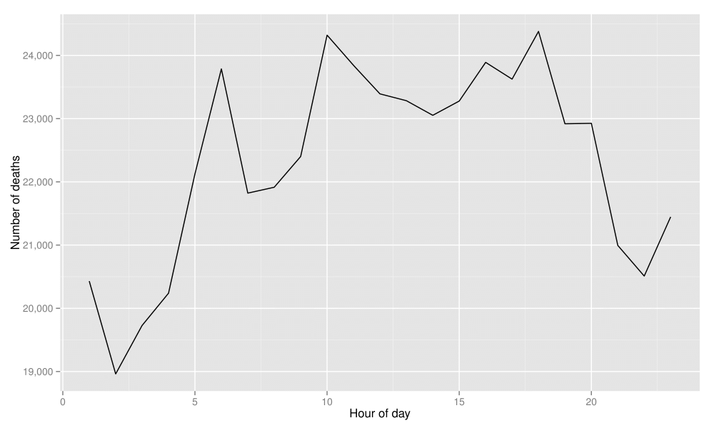
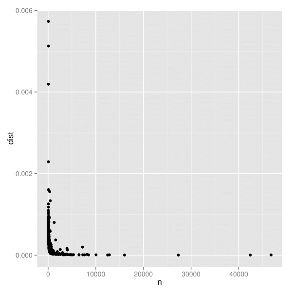
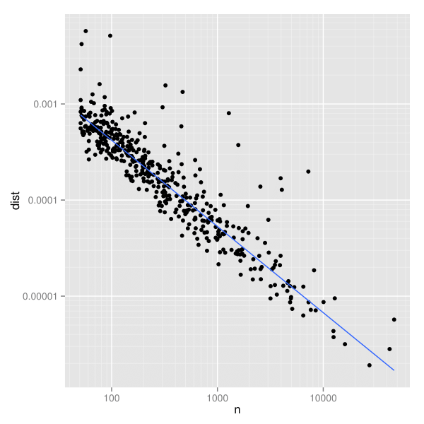
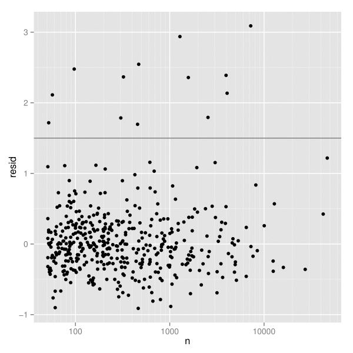
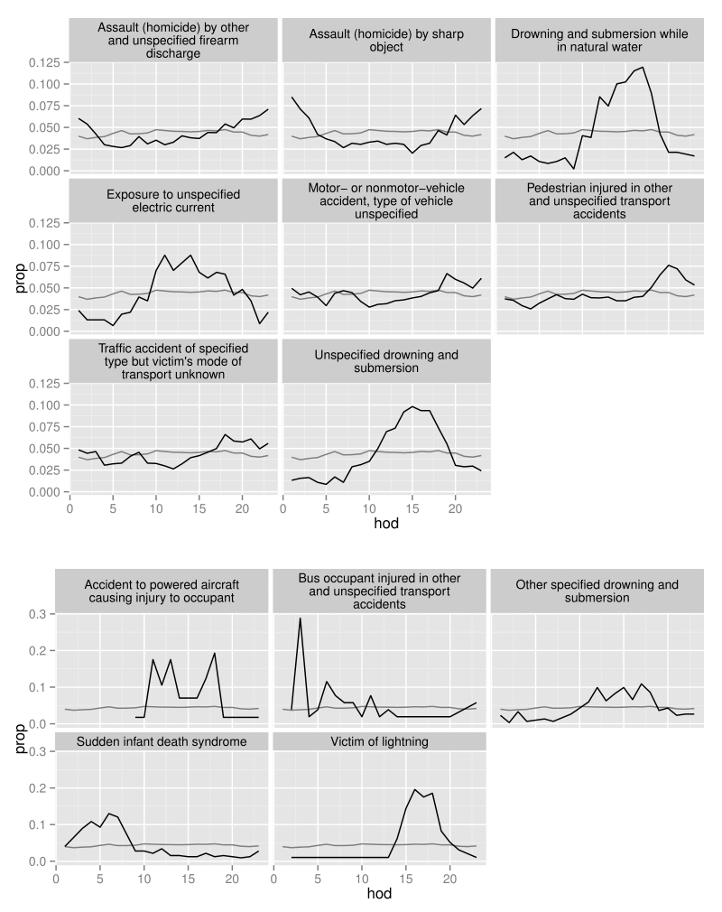

## 事例研究

以下の事例研究では、整然データと整然ツールが、操作・可視化・モデル化の間の移動を容易にし、結果としてデータ分析を容易にすることを示す。ある関数の出力を他の関数への入力として正しい形式に変換するためだけに存在しているコードを見ることは一切ない。これから、分析を行うためのRコードを示す。ここでは、コード・結果・説明をしっかりと結びつけた形で交互に示すことで、Rについてよく知らなくても、あるいは私の使った慣用的手法についてよく知らなくても、容易に理解できるように努めたつもりだ。

この事例研究では、個人を単位としたメキシコでの死亡率データを使用する。最終的な目標は、1日を範囲としたときに異常な時間的パターンが見られる死因を検出することにある。図1は、すべての死因について1時間当たりの死亡者数を示した時間的パターンである。このパターンから最も離れている疾患を検出することが目標である。



図1：すべての死因についての時間的パターン。

この事例研究の完全なデータセットには、2008年のメキシコにおける53万9530人の死亡に関する情報がある。そして、このデータセットには、死亡場所、死亡時間、死因、死亡者に関する人口統計学的な情報など55個の変数が含まれている。表15は、このデータセットの小規模な標本を示している。この表は、死亡時刻に関する変数（`year`「年」・`month`「月」・`day`「日」・`hour`「時」）と死因に関する変数（`cod`）に焦点を合わせている。

|   yod|  mod|  dod|  hod| cod |
|-----:|----:|----:|----:|:----|
|  2008|    1|    1|    1| B20 |
|  2008|    1|    2|    4| I67 |
|  2008|    1|    3|    8| I50 |
|  2008|    1|    4|   12| I50 |
|  2008|    1|    5|   16| K70 |
|  2008|    1|    6|   18| I21 |
|  2008|    1|    7|   20| I21 |
|  2008|    1|    8|    —| K74 |
|  2008|    1|   10|    5| K74 |
|  2008|    1|   11|    9| I21 |
|  2008|    1|   12|   15| I25 |
|  2008|    1|   13|   20| R54 |
|  2008|    1|   15|    2| I61 |
|  2008|    1|   16|    7| I21 |
|  2008|    1|   17|   13| I21 |

表15：53万9530行×55列の元のデータセットから、16行×5列を取り出した標本。

異常な時間的パターンを見つけるという目標を達成するために、以下のことを行う。まず、整然である`count`関数を用い、個々の`cod`（死因）について`hod`（死亡の時間）ごとの死亡者数を数え上げる。

```
hod2 <- count(deaths, c("hod", "cod"))
```

次に、`subset`を使って、欠損値を取り除く（欠損値は欠損しているゆえに、本事例研究の目的に対する情報価値がない）。

```
hod2 <- subset(hod2, !is.na(hod))
```

このことにより、表16(a)が得られる。次に、疾患について分かりやすいラベルを準備するために、このデータセットを`codes`データセットと結びつける。結びつけるときには、`cod`（死因）変数に基づいて結びつける。すると、表16(b)に示すように、新しい変数である`disease`（疾患）が付け加わる。

```
hod2 <- join(hod2, codes, by = "cod")
```

|  hod| cod |  freq|
|----:|:----|-----:|
|    8| B16 |     4|
|    8| E84 |     3|
|    8| I21 |  2205|
|    8| N18 |   315|
|    9| B16 |     7|
|    9| E84 |     1|
|    9| I21 |  2209|
|    9| N18 |   333|
|   10| B16 |    10|
|   10| E84 |     7|
|   10| I21 |  2434|
|   10| N18 |   343|
|   11| B16 |     6|
|   11| E84 |     3|
|   11| I21 |  2128|

| disease                     |
|:----------------------------|
| Acute hepatitis B           |
| Cystic fibrosis             |
| Acute myocardial infarction |
| Chronic renal failure       |
| Acute hepatitis B           |
| Cystic fibrosis             |
| Acute myocardial infarction |
| Chronic renal failure       |
| Acute hepatitis B           |
| Cystic fibrosis             |
| Acute myocardial infarction |
| Chronic renal failure       |
| Acute hepatitis B           |
| Cystic fibrosis             |
| Acute myocardial infarction |

|  prop|
|-----:|
|  0.04|
|  0.03|
|  0.05|
|  0.04|
|  0.07|
|  0.01|
|  0.05|
|  0.04|
|  0.10|
|  0.07|
|  0.05|
|  0.04|
|  0.06|
|  0.03|
|  0.05|


|  freq\_all|  prop\_all|
|----------:|----------:|
|      21915|       0.04|
|      21915|       0.04|
|      21915|       0.04|
|      21915|       0.04|
|      22401|       0.04|
|      22401|       0.04|
|      22401|       0.04|
|      22401|       0.04|
|      24321|       0.05|
|      24321|       0.05|
|      24321|       0.05|
|      24321|       0.05|
|      23843|       0.05|
|      23843|       0.05|
|      23843|       0.05|

表16：データフレームの`hod2`から取り出した4つの疾患と4つの時間についての標本。


死因ごとの死亡総数の違いは、何桁にもわたる。心臓発作による死亡は4万6794人であるのに対し、雪崩による死亡はわずか10人に過ぎない。ここから、総数でなく、1時間あたりの死亡率を比較することが理にかなっていることが示唆される。これは、`cod`（死因）でデータセットを分割し、`transform()`を用いて1時間あたりの頻度をその死因の総死亡数で割った`prop`（比率）という新しい列を加えることで求められる。この新しい列は、表16(c)に示されている。

`ddply()`は、第1の引数 (`hod2`) を第2の引数（`cod`変数）で分割し、第3の引数 (`transform`) を分割された個々の部分に適用する。第4の引数 (`prop = freq / sum(freq)`) は、`transform()`にわたされる。

```
hod2 <- ddply(hod2, "cod", transform, prop = freq / sum(freq))
```

次に、1時間あたりの全体的な平均死亡率を計算し、元のデータセットに統合する。これにより表16(d)が得られる。`prop`（比率）と`prop_all`（全体的な比率）を比較することで、各疾患を全体の発生パターンと容易に比較することができる。

まず、1時間ごとの死亡者数を何とかしよう。`hod`で`hod2`を分割し、死因ごとに合計を計算する。

```
overall <- ddply(hod2, "hod", summarise, freq_all = sum(freq))
```

次に、1時間ごとに、全体的に見たときの死亡者の割合を計算する。

```
overall <- transform(overall, prop_all = freq_all / sum(freq_all))
```

最後に、全体的に見たデータセット (`overall`) を個別的に見たデータセット (`hod2`) と結合することで、両者を比較しやすくする。

```
hod2 <- join(hod2, overall, by = "hod")
```

次に、1つ1つの死因の時間的パターンと全体の時間的パターンとの間の距離を計算する。この距離を測定するやり方にはさまざまなものがあるが、単純平均二乗偏差 (simple mean squared deviation) が理解を助けるだろう。また、各死因について、標本の大きさ（その死因による総死亡者数）を記録する。考察対象とする疾患が十分に代表的なものであるようにするために、50人（1時間当たり約2人）を超える死亡がある疾患のみを扱うものとする。

```
devi <- ddply(hod2, "cod", summarise, n = sum(freq),
  dist = mean((prop - prop_all)^2))
devi <- subset(devi, n > 50)
```

この推定量の分散に関する特性は分からないが、図2(a)のように`n`（標本の大きさ）と`deviation`（偏差）を図示することで視覚的に探索することができる。線形な目盛りでは、標本の大きさが増えるにつれて散らばりが小さくなること以外、図から分かることはほとんどない。しかし、両対数目盛りにした図2(b)では、明確なパターンが見いだせる。このパターンは、頑健な線形モデルから得られた最適の当てはめ直線を追加すると特に見やすくなる。

```
ggplot(data = devi, aes(x = n, y = dist) + geom_point()
last_plot() + scale_x_log10() + scale_y_log10() +
  geom_smooth(method = "rlm", se = F)
```



図2(a)：`n`（標本の大きさ）と`deviation`（偏差）のグラフ。偏差の散らばりは標本の大きさに大きく左右されており、標本が小さいほど散らばりが大きい。




図2(b)：両対数のグラフは散らばりのパターンと異常に高い値を見いだしやすい。青線は最も当てはまりがよい頑健な直線である。



図3：log(<i>n</i>) から log(<i>dist</i>) を予測する頑健な線形モデルからの残差。1.5のところにある水平線は、さらなる探索のための閾値を示す。

我々は、<i>x</i>軸に関して近いもの同士の中で<i>y</i>の値が相対的に大きいような点に関心を持っている。死亡者数を統制したとき、こうした点は全体のパターンから最もかけ離れた疾患を表す。

こうした異常な点を見つけるために、頑健な線形モデルを当てはめ、残差を図示する（図3）。図では残差が1.5の辺りが何もない領域となっている。このため、いささか恣意的ではあるが、残差が1.5以上になる疾患を選び出すことにする。このことは、2段階で行われる。まず、`devi`（疾患ごとに1行）から適切な行を選択する。そして、元の要約データセット（疾患ごとに24行）から一致する時間経過の情報を見つけ出す。

```
devi$resid <- resid(rlm(log(dist) ~ log(n), data = devi))
unusual <- subset(devi, resid > 1.5)
hod_unusual <- match_df(hod2, unusual)
```

最後に、異常な死因ごとに時間的推移を図示する（図4）。ここで、変動の違いにより、疾患を2つの図に分けた。上の図は、死亡者数が350人を超える疾患を示す。これに対して、下の図は死亡者数が350人に満たない疾患を示している。死因は、殺人・溺死・交通関連の3つの主要なグループに分類される。殺人は、夜間によく見られる。溺死は午後に見られる。交通関連の死亡は、通勤時間帯に見られる。背景の薄い灰色の線は、すべての病気を通じて見たときの時間的推移を示している。

```
ggplot(data = subset(hod_unusual, n > 350), aes(x = hod, y = prop)) +
  geom_line(aes(y = prop_all), data = overall, colour = "grey50") +
  geom_line() + facet_wrap(~ disease, ncol = 3)
```



図4：異常な時間的推移が見られる死因。全体の1時間ごとの死亡率は灰色で示されている。（上側）1年で死亡者が350人を超える死因 ((訳注：上側における死因を和訳すると以下の通りになる。（上側の上段）左から順に、「その他及び詳細不明の銃器の発射による加害にもとづく傷害及び死亡」、「鋭利な物体による加害にもとづく傷害及び死亡」、「自然の水域内での溺死及び溺水」。（上側の中段）左から順に、「詳細不明の電流への曝露」、「車両（駆動形態を問わない）事故、車両の型式不明」、「その他及び詳細不明の交通事故により受傷した歩行者」。（上側の下段）左から順に「事故の形態が明示され、受傷者の輸送形態が不明の路上交通事故」、「詳細不明の溺死及び溺水」。なお、この事例研究における死因は、国際疾病分類第10版 (ICD-10) と呼ばれる分類に従っている。死因の和訳は[標準病名マスター作業班](http://www.dis.h.u-tokyo.ac.jp/byomei/index.html)が提供している ICD-10 の和訳によった。)) 。（下側）死亡者が350人に満たない死因 ((訳注：下側における死因を和訳すると以下の通りになる。（下側の上段）左から順に、「乗員が受傷した動力航空機事故」、「その他及び詳細不明の交通事故により受傷したバス乗員」、「その他の明示された溺死及び溺水」。（下側の下段）左から順に「乳幼児突然死症候群」、「落雷による受傷者」。)) 。上側と下側とで<i>y</i>軸の目盛りが異なることに注意。
